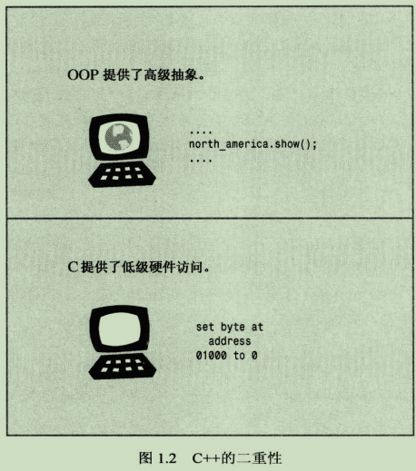
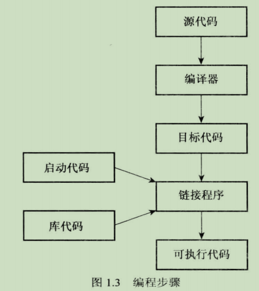

# 前言
C++ 包含的编程范式：面向对象（类），面向过程(C)，泛型编程（模板）。
### 1.2.1 C语言
**低级语言**：汇编语言直接访问CPU寄存器和内存单元，移植到另外一台计算机时，需要重新编写程序。
**高级语言**：致力于解决问题，而不针对特定硬件。不同平台使用不同的编译器将同一个高级语言程序翻译为特定计算机的内部语言。C语言诞生了 ：低级语言的效率，硬件访问能力和高级语言的通用型，可移植性。
### 1.2.2 C语言编译原理
C 语言是过程性语言， 强调算法。
早期程序语言（FORTRAN和BASIC），如果程序规模很大，难以阅读和修改。因此有了结构化编程方法。C语言包含了这些结构（for 循环，while 循环，do while 循环和 if else 语句）。结构化编程方法反映了过程性思想，根据执行操作构造一个程序。
新原则：自顶而下设计。就是大的程序分解为小的任务。这些任务模块也就是函数。
### 1.2.3 面向对象编程OOP
OOP强调数据。理念是：设计与问题的本质特性相对应的数据格式。
OOP 首先设计类，然后使用这些类的对象设计一个程序。从低级组织（类）到高级组织（程序）的处理过程叫做 **自下向上** 编程。
OOP编程：重点放在表示概念上。
- 类
- 可重用代码
- 信息隐藏：访问控制
- 多态：为运算符和函数创建多个定义，通过编程上下文来确定使用哪个定义。
- 继承：父类造出子类
C++ 真正的优点之一是：使用大量已有的类库。方便重用和修改。
### 1.2.4 C++和泛型编程
OOP强调的是数据方面，泛型编程强调的是独立于特定的类型。
OOP是一个管理大型项目的工具，而泛型编程提供了执行常见任务（如对数据排序或合并链表）的工具。
对不同类型的数据进行排序，需要每个类型创建一个排序函数。而泛型编程：只写一个泛型函数，可以使用各种类型。
泛型编程在C++中是模板。
### 1.2.5 C++ 起源
小知识：C++ 名字来源于C语言中的递增运算符++。

OOP使C++具有将问题涉及的概念联系起来的能力。C语言部分让C++紧密联系硬件的能力。
模板使得泛型编程成为可能。

## 1.3可移植性
可移植性：不需要修改代码，只需要重新编译就可运行
可移植性：
- 硬件特定程序不可移植
- 语言差异，可能有多个版本的C++，因此需要标准
C++98：异常，运行阶段类型识别（RTTI），模板和标准模板库（STL）。
C++11：
标准旨在实现C++在不同计算平台和不同实现的可移植性。

## 1.4 程序创建

### 1.4.1 创建源代码
采用 VScode
安装插件：C/C++，Code Runner
后缀名直接： *.cpp*

### 1.4.2 编译和链接

Linux: g++

