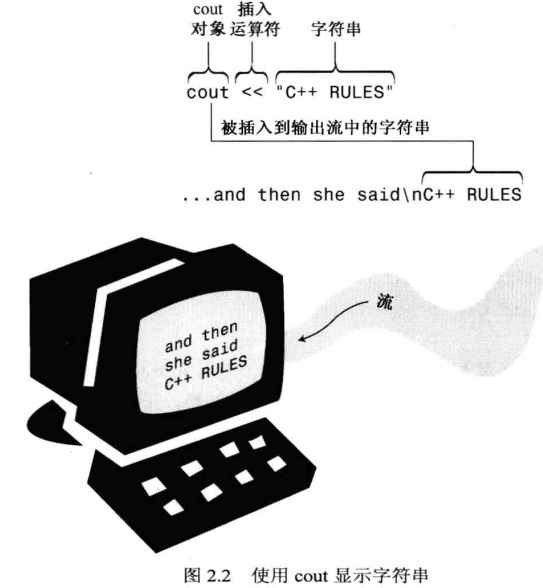

mian()被启动代码调用。启动代码由编译器添加到程序中，是程序和操作系统间的桥梁。该函数头描述的是main()和操作系统之间的接口。

### 2.1.3 C++ 编译预处理器和 iostream 文件

C++ 和 C一样，在程序进行主编译之前，使用一个 **预处理器** 对源文件进行处理。本文只讨论预处理器处理以 **# 开头的编译指令**。不用调用该预处理器，编译程序时会自动调用。

    #include <iostream>  

上面的编译指令让预处理器将 iostream 文件的内容添加到程序中。
预处理器操作：在源代码被编译之间，替换或添加文本。

为什么要将 iostream 文件的内容添加到程序中？

因为要使用 **cout** 输出。 iostream 文件的内容将替换源代码中的 `#include <iostream> ` 。源代码和 iostream 组合成一个复合文件，编译时候使用这个复合文件。

### 2.1.4 头文件名

包含文件：被其他文件包含，也叫头文件：在其他文件的开头。

C++ 新风格头文件没有扩展名。

### 2.1.5 名称空间

名称空间就像独立的文件夹，下面可以放相同名字的 类、函数、变量，而不引起冲突，使得编译器不知道用哪个。有助于程序组织，因为编写大程序以及将多个厂商的代码组合在一起时更加容易。

`using` 是名称空间编译指令，大型项目中，最好使用 `using` 只使用所需的名称，而不是 `using namespace std;`，如下：

    using std::cout;
    using std::endl;
    ...

### 2.1.5 cout

字符串：双引号

cout 是一个对象。对象的好处：知道接口就可以使用它。

C++ 对输入输出的解释是 **流** 的概念。

插入运算符 `<<` 是 左移运算符的重载。通过重载，同一个运算符有了不同的含义，**编译器通过上下文来确定运算符的含义**。所谓的上下文来判断就和自然语言中的含义需要根据语境（上下文）来判断一样。

C++ 允许为码工自己定义的类，重新定义运算符含义。

换行有两种：

- endl :控制符，可以确保程序继续运行前立刻显示在屏幕上
- \n 转义序列，无法确保上述

### 2.1.7 代码规范

C++11 新增的原始字符串可以包含回车（Enter）。

- 每条语句占一行
- 每个函数都有{},每个花括号占一行
- 函数中的语句相对花括号进行缩进
- 与函数名称相关的()周围没有空白

## 2.2 语句

代码见：`2_2_carrots.cpp`

### 2.2.1 声明语句和变量

信息存储在计算机中，必须指出存储位置和所需内存空间。C++ 使用声明语句来完成该任务。

    int carrots;

int 表示所需内存空间大小。变量名表示该内存单元的名称，内存单元内的值可以修改，所以叫变量。这就像变量名是门牌号，变量类型是房间的类型（如大床房，但是标间）房间大小不同，而房间内的东西可以改变，所以是变量。

**为什么所有变量都要声明？**

为了防止有些变量没有声明就使用，会报错。

声明语句：

- 定义声明：导致编译器为变量分配内存空间
- 引用声明：不分配内存空间

声明不一定是定义。

### 2.2.2 赋值语句

C++ 可以连续使用赋值语句，如下：

    int a;
    int b;
    int c;
    a = b = c = 88;

 赋值运算符更新了变量名对应的内存单元内的值。

### 2.2.3 cout

    cout << carrots;

cout 将carrots替换为当前值25，把25转为字符串 "25".。

cout 智能的知道输出的类型。 插入运算符 << 根据后面的数据类型调整行为。

抛弃C语言中的 printf()，使用 cout。

## 2.3

cin： 输入流

cout 输出拼接

函数可以来自函数库，类可以来自类库。

类描述指定了可对类对象执行的所有操作。要对特定的对象执行这些操作，需要给该对象发一条消息。两种发送消息的方式：

- 使用类方法（函数调用）
- 重新定义运算符（运算符重载）

## 2.4 函数

两种函数：

- 有返回值的
- 无返回值的

参数是发送给函数的信息，返回值是从函数中发出去的值。

使用函数之前，编译器需要知道函数的参数类型和返回值类型。解决方法：使用函数原型语句。

double ：实数

    double sqrt(double); //函数原型

第一个double：返回类型；第二个double：参数类型。 `;`表示它是一条语句，省略 `;`，编译器会把该行代码理解为一个函数头，后面要求是函数体。

**变量声明，函数原型**类似。

两种方法提供函数原型：

- 源代码中写函数原型
- 包含头文件，头文件中定义函数原型（**推荐**）

函数原型和函数定义不同。原型只描述函数接口（返回类型和参数类型）。定义包含函数的代码。库文件包含了函数的代码，头文件包含了函数原型。

应在函数首次使用之前提供原型。常把原型放在main()函数定义的前面。

代码2.4 中 cmath 头文件中提供了原型。

C++ 允许在创建变量的时候对它赋值，如：

    double side = sqrt(area); // 初始化

变量概念：

  - 声明
    - 定义声明
    - 引用声明
  - 定义
  - 初始化

### 2.4.2 函数变体

  - 多个参数
    - 原型：`double pow(double, double);`
    - 调用：`answer = pow(5.0, 8.0)`
  - 没有参数
    - 原型：`int rand();`
    - 调用：`myGuess = rand();`
  - 无返回值的函数  
    - 原型：`void bucks(double);`
    - 调用：`bucks(1234.56);`

### 2.4.3 码工自定义的函数

代码2.5: **最简单办法（大型代码一般不这样）**：自定义函数 simon 的原型放在main(),函数的源代码放在main()后面。调用之前必须提供函数原型。

C++ 不允许将函数定义嵌套在另一个函数定义中。

将操作系统看作调用程序，main()的返回值并不返回给程序其他部分，而是返回给操作系统。操作系统使用返回值判断是否程序运行成功。 返回 0 表示程序运行成功，非0 表示存在问题。

关键字就是保留字，反正不能乱用就行了。

### 2.4.3 码工自定义的有返回值的函数

所谓的函数就是数学中的 `y = f(x)`，f 就是一个黑箱，函数原型诠释了这种黑箱的观点（关心输入输出，不关心内部实现）。

函数特点：

- 函数头、函数体
- 参数
- 返回值
- 原型

### 2.4.5 多个函数中使用 using 编译指令

程序访问名称空间 std 的四种方法：

- `using namespace std;` 放在函数定义之前，文件中所有的函数都可以使用 std 中的元素。
- `using namespace std;` 放在特定函数定义中，只有该函数可以使用 std 中的元素。
- 在特定函数中使用： `using std::cout;` 这种，只有该函数可以使用 std 中指定的元素，如 cout。
- 完全不使用 using, 需要使用时候，加 `std::`， 如 `std::cout << "I'm OK!" << std::endl;`

个人认为第三种更方便。

## 2.5 总结

C++ 语句：
  - 声明语句
  - 赋值语句
  - 消息语句：将消息发给对象，激发某种行为
  - 函数调用
  - 函数原型
  - 返回语句

cin 和 cout 是 istream 和 ostream 类的对象。这两个类在 iostream 文件中定义。cin 和 cout都是智能对象，能够根据上下文自动转换信息形式。

C++ 可以使用大量的C库函数。包含提供该函数原型的头文件即可。